

# Drug Interaction Severity Prediction
Generative AI provided limited assistance in line with the course policy on usage of AI.

---

### Introduction

Modern medication management can involve patients taking five or more medications simultaneously, a practice referred to as polypharmacy [1]. Physicians account for drug-drug interactions (DDIs) when prescribing and often use software to flag potential interactions [1]. Supplementary screening approaches could potentially improve patient safety and help providers quickly identify DDIs [1].

DDIs represent a significant clinical risk of polypharmacy. Data from 2015 to 2018 showed roughly one in four American adults filled three or more prescriptions monthly, climbing above two-thirds in patients aged 65 and older [1]. Federal regulators have revised DDI safety guidance since the late 1990s in response to documented efficacy and safety failures [1]. Clinical trial testing cannot cover every possible drug combination, leaving pharmacovigilance systems to detect harmful interactions reactively, often after patient harm has occurred.

This project uses the Deep-Pharma Multimodal Intelligence DataHack 3.0 Kaggle competition [2], selected for its direct relevance to biomedical and health informatics, its use of real FDA FAERS data, and the challenge of a cold-start test set of unseen molecular scaffolds across three simultaneous prediction tasks. The model predicts interaction severity (Minor, Moderate, or Major), which of 50 adverse events will occur, and per-adverse-event risk using Proportional Reporting Ratio (PRR). Success is evaluated using a composite Hardcore Clinical Score from 0.0 to 1.0, weighted across severity classification (40%, Macro F1), side effect prediction (30%, Micro F1), and PRR regression (30%, inverse RMSE). A reliable model has direct implications for patient safety, offering a scalable screening layer that could strengthen clinical decision support at the point of prescribing.

This project addresses two research questions. RQ1: Can a multi-task machine learning model accurately predict DDI severity, adverse event occurrence, and PRR risk from pharmacological and molecular drug pair features? RQ2: What natural groupings exist within drug pair interaction profiles, and do these clusters align with meaningful differences in severity and side effect patterns? RQ2 extends beyond the competition scope as an exploratory contribution applying unsupervised learning to examine whether adverse event profiles segment in clinically meaningful ways.

---

### Methods

**Data**

The training dataset contained 15,284 drug pair observations across 126 columns (Table A1). The severity target was multiclass: Moderate (69.1%), Major (26.7%), and Minor (4.1%), yielding a 16.8:1 imbalance ratio between the majority and minority classes (Table B1, Figure C1). This imbalance directly motivated Macro F1 as the primary severity evaluation metric, which weights all classes equally. Adverse event burden was highly skewed: 68.5% of pairs reported no adverse events and 14.7% reported 40 or more, producing a bimodal distribution (Table B2, Figure C2). Among non-zero PRR entries, values ranged up to 240.0 with a mean of 3.89 and median of 2.50 (Table B3, Figure C4). Only 21.5% of PRR entries were non-zero. CYP450 enzyme profiles were missing for 59.5% of Drug A and 47.1% of Drug B observations; FDA warning fields were missing in 31.0% and 11.3% of cases respectively (Table B4, Figure C5). Missing values were replaced with empty strings prior to vectorization so absent fields contributed no signal.

**Preprocessing**

All non-target text columns including mechanism of action, pharmacodynamics, ADME fields, CYP450 profiles, indications, warnings, and toxicity data were concatenated into a single string per drug pair. An 80/20 stratified train/test split was applied before feature extraction. TF-IDF vectorization with 2,000 tokens and English stop word removal was fit on the training split only to prevent leakage. SMILES strings were included as raw text; this captures token-level molecular notation rather than true structural properties and likely limits PRR performance. All three tasks used the same feature matrix.

**Severity Classification**

Three classifiers were trained: Logistic Regression, Random Forest, and Gradient Boosting. Logistic Regression served as the interpretable baseline. Random Forest reduces variance through bootstrap sampling and handles text-derived features without scaling. Gradient Boosting fits each new tree to residual errors of the current ensemble, learning feature interactions the other models cannot capture. All three were evaluated using 5-fold cross-validation on a 3,000-observation training subset for runtime efficiency, then scored on the held-out test set using multiclass AUC and Macro F1 (Table B6, Figure C8). Final hyperparameters: Logistic Regression `max_iter=1000`; Random Forest `n_estimators=100`; Gradient Boosting `n_estimators=100`, `max_depth=3`, `learning_rate=0.1`. Gradient Boosting was selected based on the highest AUC (0.9252) and Macro F1 (0.5666) on the test set (Table B5, Figure C6). Feature importance was extracted via MDI. A shallow decision tree (max depth=3) was fit separately as an interpretability tool only (Figures C9, C10).

**Binary Side Effect Prediction**

A MultiOutputClassifier wrapping Logistic Regression was fit independently per label on the same TF-IDF matrix. Performance was evaluated using global Micro F1, which penalizes null predictions and requires active detection of true positives, and per-label F1 and AUC across all 50 adverse events on the held-out test set (Table B11, Table B12, Figure C14).

**PRR Regression**

A multi-output Ridge regressor was trained to predict PRR for each of the 50 adverse events. Predictions were clipped at zero. RMSE was computed only on pairs where ground truth PRR was greater than zero, penalizing errors on confirmed signal pairs. Inverse RMSE (1 / 1 + RMSE) was used as the score component, where higher values indicate better performance (Table B13, Table B14, Figure C15). Ridge was selected for stability on high-dimensional sparse input.

**Unsupervised Clustering**

To address RQ2, K-means clustering was applied to the 50 binary adverse event columns. A silhouette score sweep across k=2 through k=6 selected k=2 with a score of 0.776 (Figure C11). Severity label composition and adverse event prevalence were examined within each cluster to assess clinical alignment (Figures C12, C13). Full reproducibility details and source code are available in the project GitHub repository.

---

### Results and Evaluation

Micro-average AUC was the primary severity metric. Micro F1 was used for side effect prediction. Inverse RMSE on masked data was used for PRR. These three metrics compose the Hardcore Clinical Score weighted as severity (40%), side effects (30%), and PRR (30%).

**Severity Classification**

All three models achieved AUC above 0.91, indicating strong class-level discrimination (Table B7, Figure C6). Gradient Boosting was highest across all metrics and selected as the final submission model. AUC differences are narrow (delta less than 0.008), suggesting further gains require feature engineering rather than model switching.

| Model | Accuracy | Macro F1 | AUC |
|-------|----------:|---------:|----:|
| Logistic Regression | 0.7694 | 0.5395 | 0.9241 |
| Random Forest | 0.7661 | 0.5639 | 0.9146 |
| Gradient Boosting | 0.7746 | 0.5666 | 0.9252 |

Cross-validation accuracy was stable across all models ranging from 0.741 to 0.757 (Table B6, Figure C8). Per-class recall showed a consistent failure pattern across all models (Figure C7, Tables B8-B10). Moderate recall exceeded 91% in Gradient Boosting. Major recall ranged from 42% to 50%. Minor peaked at 19.8%. The 16.8:1 imbalance drives this failure and confirms Macro F1 as the appropriate metric. Feature importance identified lymphocytes as the dominant token, followed by smooth, exercise, diet, and glucose — consistent with known high-risk DDI drug classes affecting metabolic and immunological pathways (Figures C9, C10).

**Binary Side Effect Prediction**

The multi-label classifier achieved Micro F1 of 0.5772, Macro F1 of 0.5698, and mean per-label AUC of 0.8938 across all 50 adverse events (Table B11). Per-label F1 ranged from 0.499 for Condition Aggravated to 0.666 for Dyspnoea with a mean of 0.570 (Table B12, Figure C14). High-prevalence systemic events including Dyspnoea, Nausea, Fatigue, and Diarrhoea were predicted most reliably. Rare events including Condition Aggravated, Loss of Consciousness, and Myocardial Infarction showed the weakest F1. Mean AUC of 0.8938 indicates strong ranking ability despite modest F1.

| Metric | Value |
|--------|------:|
| Micro F1 | 0.5772 |
| Macro F1 | 0.5698 |
| Mean per-label AUC | 0.8938 |

**PRR Regression**

PRR regression was the weakest task. Mean masked RMSE was 4.576 with mean inverse RMSE of 0.2023 (Table B13). Per-label inverse RMSE ranged from 0.088 for Atrial Fibrillation to 0.440 for Drug Ineffective (Table B14, Figure C15). Events with low PRR variance including Drug Ineffective, Death, and Nausea were predicted most accurately. Events with high variance including Atrial Fibrillation, Renal Failure Acute, and Drug Interaction showed the largest errors.

| Metric | Value |
|--------|------:|
| Mean Masked RMSE | 4.576 |
| Mean Inverse RMSE | 0.2023 |

**Composite Score**

The estimated composite Hardcore Clinical Score was 0.4605. The Kaggle submitted score was 0.5134, generated using Gradient Boosting for severity combined with the multi-label and Ridge regression outputs (Table B15). PRR regression contributed the lowest component score.

| Component | Value |
|-----------|------:|
| Severity Macro F1 (x0.40) | 0.5666 |
| Side Effect Micro F1 (x0.30) | 0.5772 |
| PRR Inverse RMSE (x0.30) | 0.2023 |
| Estimated Composite | 0.4605 |
| Kaggle Submitted Score | 0.5134 |

**Unsupervised Clustering**

K-means identified k=2 as optimal with silhouette score 0.776, declining monotonically through k=6 (Figure C11). Cluster 1 had uniformly high adverse event prevalence (0.84 to 0.97) and Cluster 2 near-zero prevalence (0.02 to 0.05) across all 20 differentiating events (Figure C12). This separation is consistent with the bimodal adverse event distribution. Severity composition was near-identical: Moderate comprised 75.1% of Cluster 1 and 67.2% of Cluster 2 (Figure C13). This directly answers RQ2. Adverse event burden and interaction severity are independent dimensions. The clusters reflect high-symptom versus low-symptom drug pair profiles rather than a clinically meaningful severity stratification.

---

### Discussion

Pharmacological text features from FDA FAERS data carry meaningful predictive signal for DDI modeling. TF-IDF representations produced strong discriminative performance for severity classification and binary side effect prediction but were insufficient for precise PRR quantification. The test set consisted of 3,974 held-out pairs with new molecular scaffolds, making generalization harder than a standard random split.

Severity classification and binary side effect prediction achieved AUC above 0.91 and 0.89 respectively, confirming text-derived features capture clinically relevant interaction patterns across unseen scaffolds. Gradient Boosting was the strongest classifier. Dominant tokens including lymphocytes, glucose, and prolongation are pharmacologically interpretable and consistent with known high-risk DDI drug classes. Per-class recall for Major and Minor remained poor, driven by the 16.8:1 imbalance. PRR regression produced a mean inverse RMSE of 0.2023, indicating TF-IDF lacks the structural resolution needed for continuous pharmacovigilance signal estimation. The composite Hardcore Clinical Score of 0.4605 reflects this unevenness across the three tasks.

K-means clustering identified two drug pair profiles defined by adverse event burden rather than severity. High-burden and low-burden pairs separated cleanly with a silhouette score of 0.776, but severity composition was near-identical within each cluster. Adverse event burden and interaction severity are independent dimensions in this dataset. This directly answers RQ2 with a meaningful negative result. A follow-up study incorporating CYP450 overlap features and molecular fingerprints could test whether structural pharmacological features recover clusters that align with severity.

**Limitations**

CYP450 profiles were missing in 47 to 60% of observations and contributed no structured signal, representing the most significant constraint on model performance. SMILES-derived molecular fingerprints were not utilized, limiting PRR performance and generalization to new scaffolds. The cross-validation subset of 3,000 observations may not fully represent the full training distribution. The binary classifier treats all 50 labels independently, ignoring co-occurrence structure. The cold-start test set structurally disadvantages text-only models and would require molecular fingerprinting or graph-based drug representations to fully address.

---

## Appendix

---

### A. Feature Dictionary

| Category | Column(s) | Description |
|---|---|---|
| **Identifiers** | `Pair_ID` | Unique row identifier for each drug interaction pair |
| | `Drug_A_Name`, `Drug_B_Name` | Generic INN names for each drug |
| | `SMILES_A`, `SMILES_B` | Text-encoded 2D molecular structure and topology |
| **Mechanism** | `Mechanism_A/B` | Molecular targets (receptors, enzymes) activated or inhibited |
| | `Pharmacodynamics_A/B` | Biochemical and physiological effects on the body |
| **Pharmacokinetics** | `Absorption_A/B` | Bioavailability and absorption rate details |
| | `Metabolism_A/B` | Site and pathway of metabolic breakdown |
| | `Elimination_Route_A/B` | Exit pathway from the body (renal, biliary, etc.) |
| | `Half_Life_A/B` | Time for plasma concentration to decrease by 50% |
| | `Protein_Binding_A/B` | Fraction of drug bound to plasma proteins (%) |
| **Metabolic Enzymes** | `CYP450_Enzymes_A/B` | CYP450 isozymes involved in metabolism; overlap is a key DDI predictor |
| **Clinical Profile** | `Indication_A/B` | Approved therapeutic indications |
| | `Warning_A/B` | FDA Black Box warnings and safety precautions |
| | `Toxicity_A/B` | Toxic effects, LD50 values, and overdose profiles |
| **Target: Severity** | `Severity` | Interaction severity class — Major, Moderate, or Minor |
| **Target: Side Effects** | `Target_Binary_[SideEffect]` x 50 | Multi-label binary flags; 1 = side effect present, 0 = absent |
| **Target: PRR Risk** | `Target_PRR_[SideEffect]` x 50 | Proportional Reporting Ratio (float); >0 = statistical signal detected |

---

### B. Data Tables

#### Table B1. Severity Class Distribution

| Severity | Count | Percent (%) | Imbalance Ratio |
|----------|------:|------------:|----------------:|
| Moderate | 10,568 | 69.1 | 16.8 |
| Major | 4,086 | 26.7 | 6.5 |
| Minor | 630 | 4.1 | 1.0 |

#### Table B2. Adverse Event Burden per Drug Pair

| Statistic | Value |
|-----------|------:|
| Mean AEs per pair | 10.77 |
| Median AEs per pair | 0.00 |
| Min AEs | 0 |
| Max AEs | 50 |
| Pairs with 0 AEs (%) | 68.5 |
| Pairs with 40+ AEs (%) | 14.7 |

#### Table B3. PRR Distribution Summary

| Statistic | Value |
|-----------|------:|
| Total PRR entries | 764,200 |
| Non-zero PRR entries (%) | 21.5 |
| Mean PRR (non-zero) | 3.892 |
| Median PRR (non-zero) | 2.500 |
| Max PRR | 240.000 |
| PRR columns | 50 |

#### Table B4. Feature Missingness Rate

| Feature | Missing (%) |
|---------|------------:|
| CYP450_Enzymes_A | 59.5 |
| CYP450_Enzymes_B | 47.1 |
| Warning_A | 31.0 |
| Indication_A | 19.1 |
| Indication_B | 11.3 |
| Warning_B | 11.3 |

#### Table B5. Model Performance Summary — Severity Classification (Test Set)

| Model | Accuracy | Macro F1 | AUC |
|-------|----------:|---------:|----:|
| Logistic Regression | 0.7694 | 0.5395 | 0.9241 |
| Random Forest | 0.7661 | 0.5639 | 0.9146 |
| Gradient Boosting | 0.7746 | 0.5666 | 0.9252 |

#### Table B6. 5-Fold Cross-Validation Accuracy (Training Subset)

| Model | CV Mean | CV Std |
|-------|--------:|-------:|
| Logistic Regression | 0.7537 | 0.0083 |
| Random Forest | 0.7410 | 0.0152 |
| Gradient Boosting | 0.7570 | 0.0153 |

#### Table B7. ROC AUC by Model (Test Set)

| Model | AUC |
|-------|----:|
| Logistic Regression | 0.9241 |
| Random Forest | 0.9146 |
| Gradient Boosting | 0.9252 |

#### Table B8. Confusion Matrix — Logistic Regression (Test Set)

| Actual / Predicted | Major | Minor | Moderate |
|--------------------|------:|------:|---------:|
| Major | 402 | 0 | 415 |
| Minor | 4 | 14 | 108 |
| Moderate | 176 | 2 | 1,936 |

#### Table B9. Confusion Matrix — Random Forest (Test Set)

| Actual / Predicted | Major | Minor | Moderate |
|--------------------|------:|------:|---------:|
| Major | 408 | 2 | 407 |
| Minor | 9 | 23 | 94 |
| Moderate | 185 | 18 | 1,911 |

#### Table B10. Confusion Matrix — Gradient Boosting (Test Set)

| Actual / Predicted | Major | Minor | Moderate |
|--------------------|------:|------:|---------:|
| Major | 342 | 1 | 474 |
| Minor | 5 | 25 | 96 |
| Moderate | 101 | 12 | 2,001 |

#### Table B11. Binary Side Effect Prediction Summary

| Metric | Value |
|--------|------:|
| Micro F1 | 0.5772 |
| Macro F1 | 0.5698 |
| Mean per-label AUC | 0.8938 |

#### Table B12. Binary Side Effect Prediction — Per-Label F1 and AUC

| Adverse Event | F1 | AUC |
|---------------|---:|----:|
| Dyspnoea | 0.666 | 0.897 |
| Nausea | 0.662 | 0.887 |
| Fatigue | 0.651 | 0.894 |
| Diarrhoea | 0.646 | 0.890 |
| Asthenia | 0.635 | 0.899 |
| Vomiting | 0.633 | 0.890 |
| Pyrexia | 0.631 | 0.890 |
| Pneumonia | 0.628 | 0.893 |
| Pain | 0.626 | 0.891 |
| Anaemia | 0.616 | 0.897 |
| Headache | 0.609 | 0.891 |
| Fall | 0.609 | 0.902 |
| Dizziness | 0.608 | 0.898 |
| Anxiety | 0.601 | 0.901 |
| Hypertension | 0.590 | 0.897 |
| Depression | 0.588 | 0.902 |
| Weight decreased | 0.583 | 0.892 |
| Arthralgia | 0.582 | 0.891 |
| Oedema peripheral | 0.578 | 0.889 |
| Pain in extremity | 0.574 | 0.888 |
| Abdominal pain | 0.571 | 0.894 |
| Back pain | 0.566 | 0.892 |
| Drug ineffective | 0.564 | 0.885 |
| Malaise | 0.564 | 0.883 |
| Chest pain | 0.564 | 0.890 |
| Insomnia | 0.563 | 0.899 |
| Death | 0.563 | 0.894 |
| Hypotension | 0.562 | 0.896 |
| Rash | 0.554 | 0.891 |
| Decreased appetite | 0.553 | 0.894 |
| Renal failure | 0.551 | 0.902 |
| Renal failure acute | 0.550 | 0.886 |
| Confusional state | 0.546 | 0.899 |
| Cough | 0.547 | 0.888 |
| Somnolence | 0.545 | 0.901 |
| Dehydration | 0.543 | 0.893 |
| Constipation | 0.538 | 0.899 |
| Urinary tract infection | 0.533 | 0.897 |
| Gait disturbance | 0.533 | 0.896 |
| Atrial fibrillation | 0.527 | 0.896 |
| General physical health deterioration | 0.526 | 0.902 |
| Haemoglobin decreased | 0.522 | 0.890 |
| Drug interaction | 0.521 | 0.890 |
| Hypoaesthesia | 0.521 | 0.901 |
| Weight increased | 0.518 | 0.896 |
| Pruritus | 0.515 | 0.889 |
| Tremor | 0.508 | 0.897 |
| Myocardial infarction | 0.504 | 0.893 |
| Loss of consciousness | 0.502 | 0.885 |
| Condition aggravated | 0.499 | 0.892 |

#### Table B13. PRR Regression Summary

| Metric | Value |
|--------|------:|
| Mean Masked RMSE | 4.576 |
| Mean Inverse RMSE (score component) | 0.2023 |

#### Table B14. PRR Regression — Per-Label RMSE and Inverse RMSE

| Adverse Event | RMSE (masked) | Inverse RMSE |
|---------------|-------------:|-------------:|
| Drug ineffective | 1.271 | 0.4404 |
| Death | 1.397 | 0.4172 |
| Nausea | 1.800 | 0.3571 |
| Fatigue | 1.925 | 0.3419 |
| Rash | 1.984 | 0.3351 |
| Dyspnoea | 2.190 | 0.3134 |
| Malaise | 2.729 | 0.2682 |
| Pain in extremity | 2.745 | 0.2670 |
| Pain | 2.838 | 0.2606 |
| Insomnia | 2.963 | 0.2523 |
| Diarrhoea | 3.033 | 0.2480 |
| Headache | 3.065 | 0.2460 |
| Arthralgia | 3.140 | 0.2416 |
| Dizziness | 3.358 | 0.2295 |
| Gait disturbance | 3.683 | 0.2135 |
| Loss of consciousness | 3.714 | 0.2121 |
| Pruritus | 3.773 | 0.2095 |
| Vomiting | 3.789 | 0.2088 |
| Weight decreased | 3.871 | 0.2053 |
| Confusional state | 4.058 | 0.1977 |
| Myocardial infarction | 4.063 | 0.1975 |
| Chest pain | 4.069 | 0.1973 |
| Condition aggravated | 4.206 | 0.1921 |
| Depression | 4.334 | 0.1875 |
| General physical health deterioration | 4.610 | 0.1783 |
| Tremor | 4.612 | 0.1782 |
| Pneumonia | 4.618 | 0.1780 |
| Pyrexia | 4.580 | 0.1792 |
| Asthenia | 4.781 | 0.1730 |
| Oedema peripheral | 4.787 | 0.1728 |
| Somnolence | 4.877 | 0.1701 |
| Hypoaesthesia | 4.917 | 0.1690 |
| Weight increased | 5.067 | 0.1648 |
| Fall | 5.162 | 0.1623 |
| Back pain | 5.213 | 0.1610 |
| Haemoglobin decreased | 5.353 | 0.1574 |
| Hypotension | 5.461 | 0.1548 |
| Abdominal pain | 5.464 | 0.1547 |
| Decreased appetite | 5.532 | 0.1531 |
| Anxiety | 5.510 | 0.1536 |
| Cough | 5.648 | 0.1504 |
| Constipation | 6.303 | 0.1369 |
| Renal failure | 6.162 | 0.1396 |
| Dehydration | 6.720 | 0.1295 |
| Urinary tract infection | 7.082 | 0.1237 |
| Anaemia | 7.291 | 0.1206 |
| Drug interaction | 7.544 | 0.1170 |
| Hypertension | 7.528 | 0.1173 |
| Renal failure acute | 9.544 | 0.0948 |
| Atrial fibrillation | 10.435 | 0.0875 |

#### Table B15. Estimated Composite Hardcore Clinical Score

| Component | Value |
|-----------|------:|
| Severity Macro F1 (x0.40) | 0.5666 |
| Side Effect Micro F1 (x0.30) | 0.5772 |
| PRR Inverse RMSE (x0.30) | 0.2023 |
| **Estimated Composite Score** | **0.4605** |
| **Kaggle Submitted Score** | **0.5134** |

---

### C. Figures

#### Figure C1. Severity Class Distribution
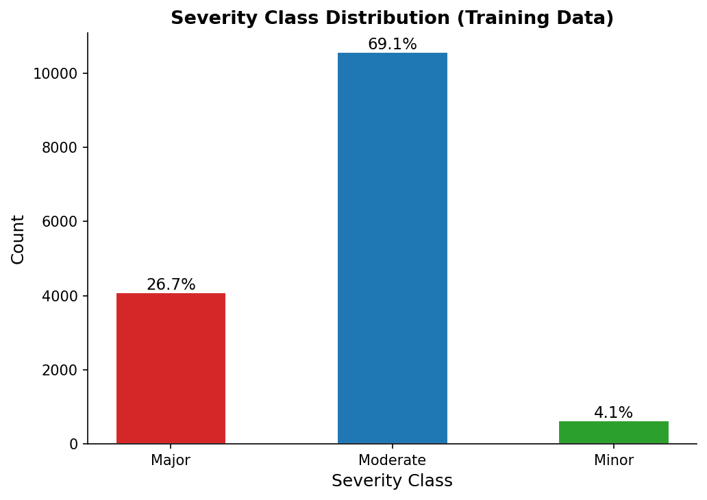

#### Figure C2. Adverse Event Burden per Drug Pair
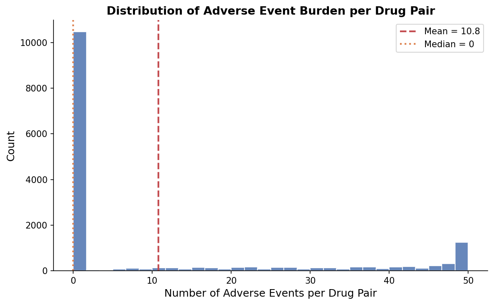

#### Figure C3. Prevalence of Each Adverse Event
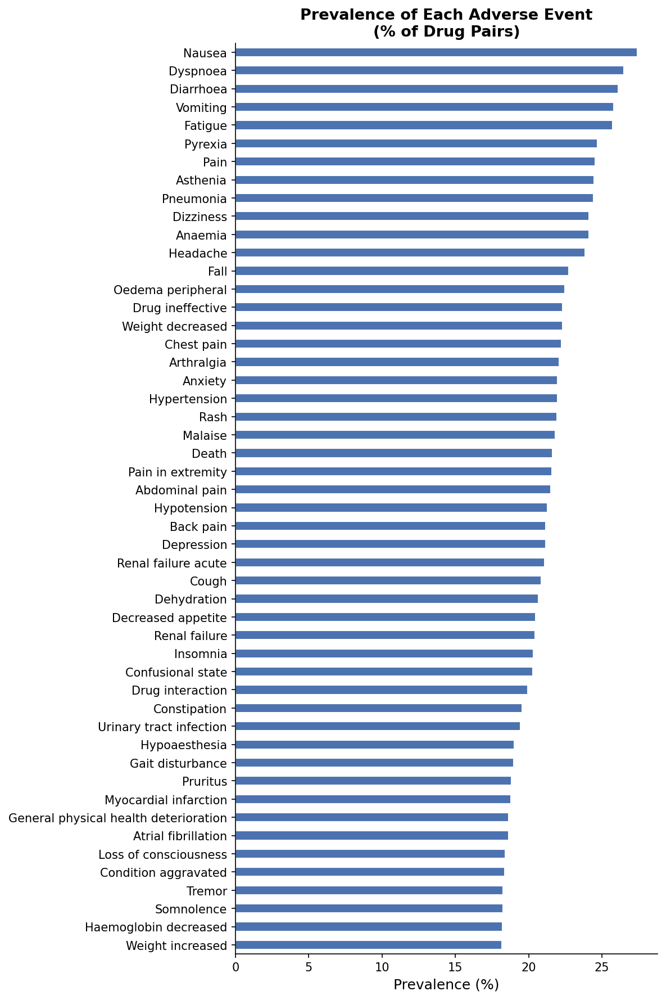

#### Figure C4. Distribution of Non-Zero PRR Values
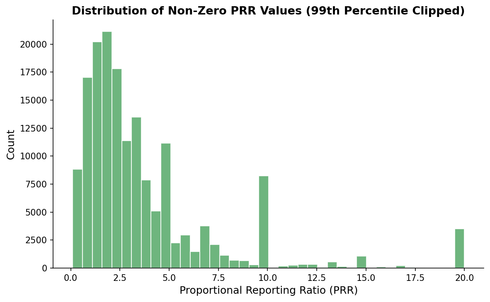

#### Figure C5. Feature Missingness Rate
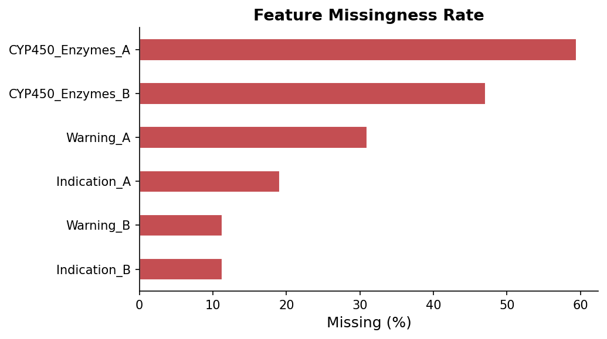

#### Figure C6. Multiclass ROC Curves (Test Set)
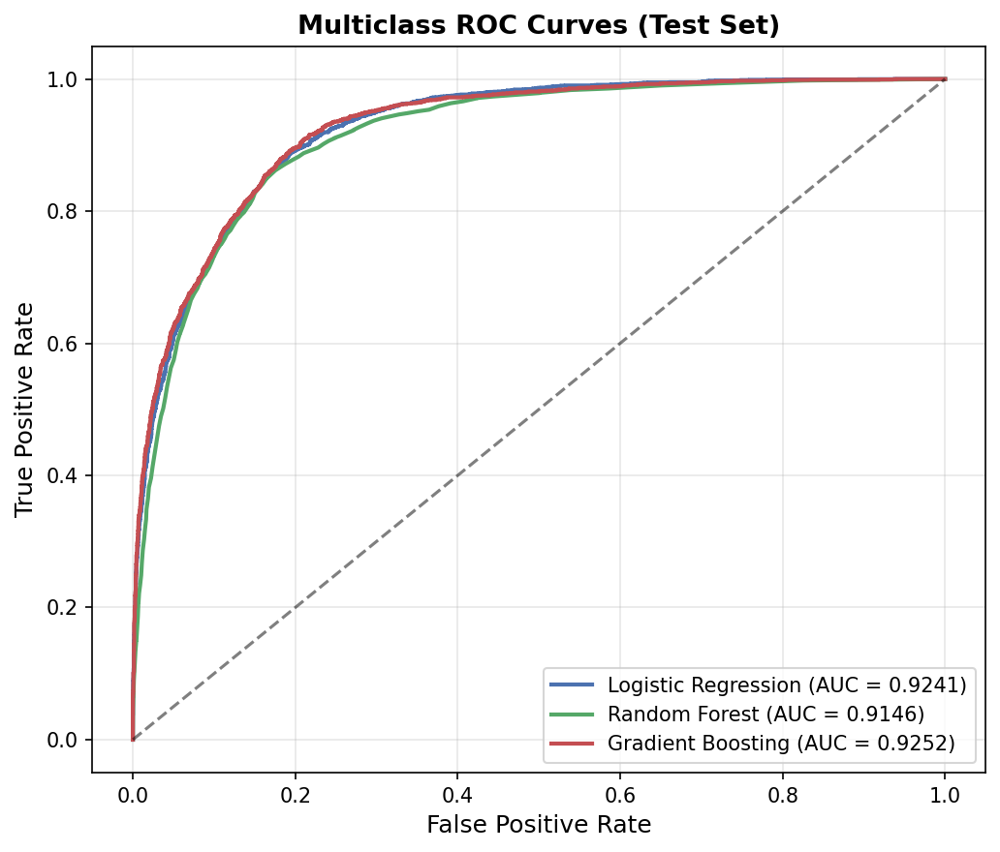

#### Figure C7. Confusion Matrices - Row-Normalized Percent (Test Set)
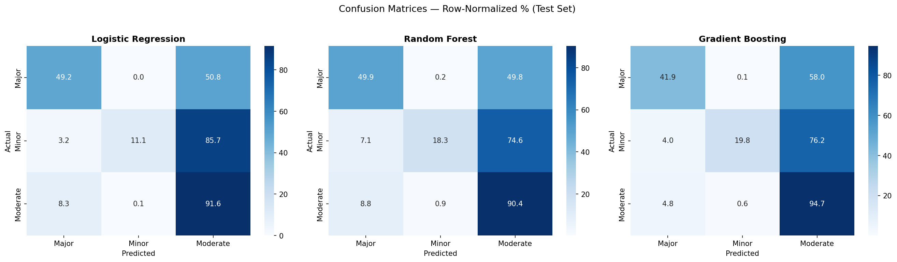

#### Figure C8. 5-Fold Cross-Validation Accuracy
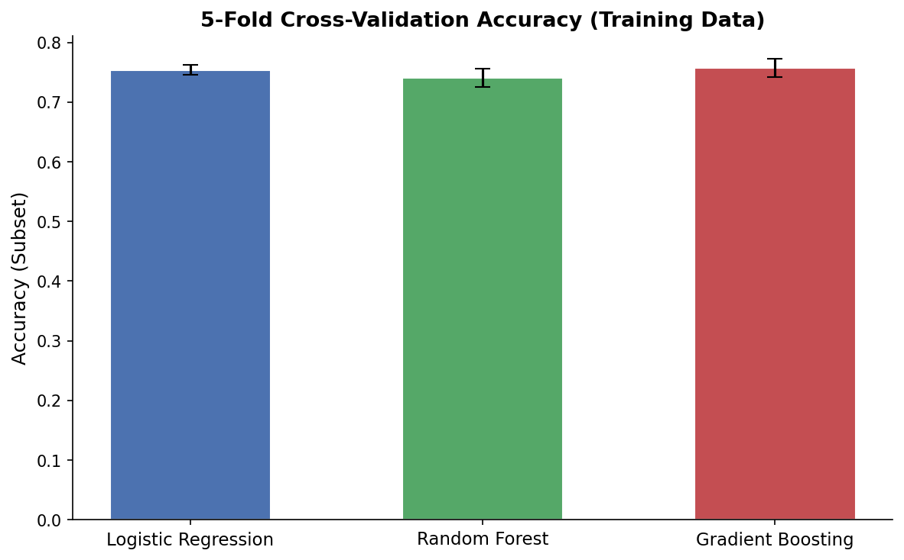

#### Figure C9. Top 12 Predictive Text Tokens (Gradient Boosting)
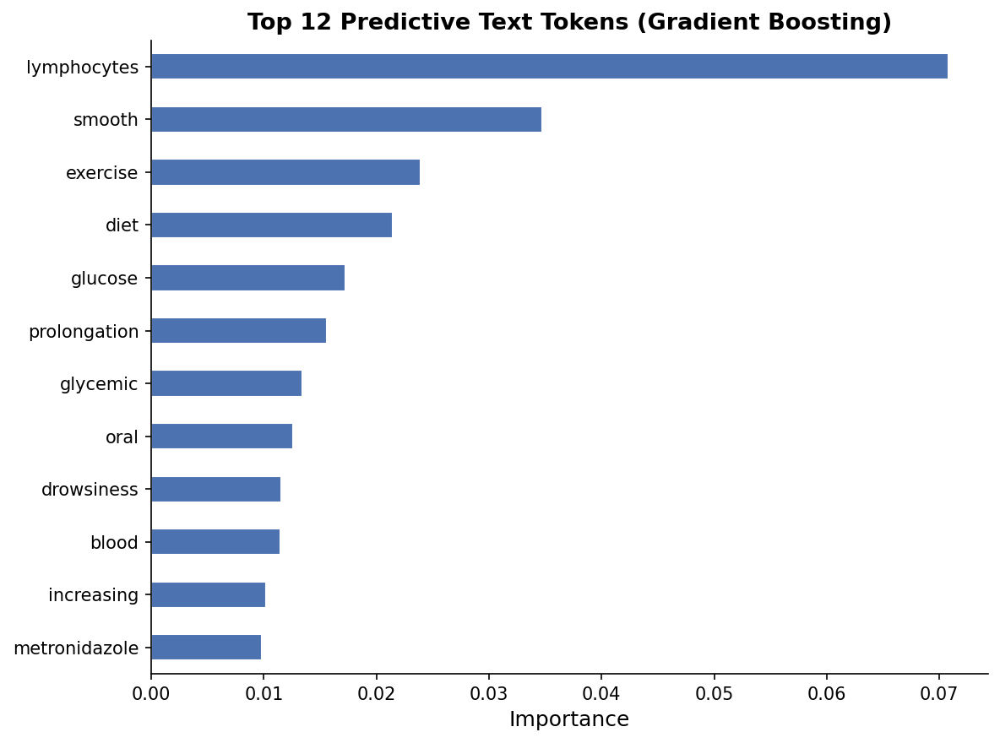

#### Figure C10. Simple Tree Showing Core Classification Logic
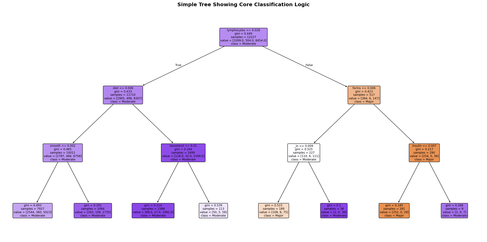

#### Figure C11. Silhouette Score vs. k (Binary Adverse Event Features)
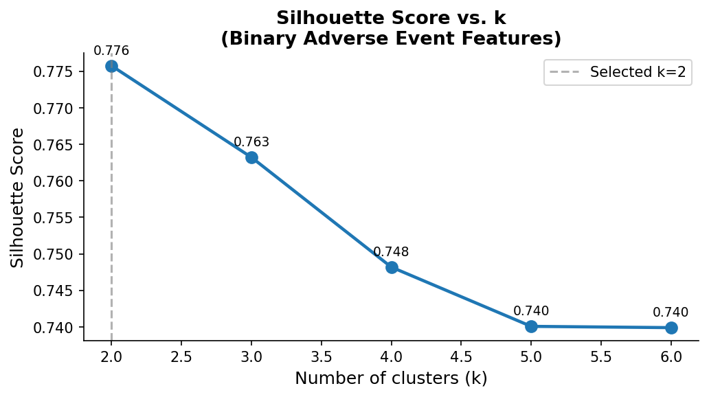

#### Figure C12. Top 20 Differentiating Adverse Events by Cluster
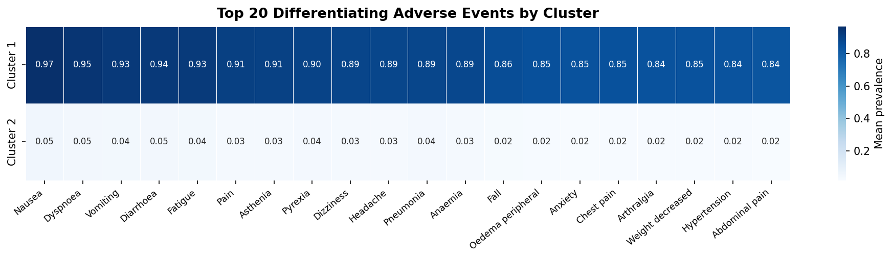

#### Figure C13. Severity Composition Within Each Cluster
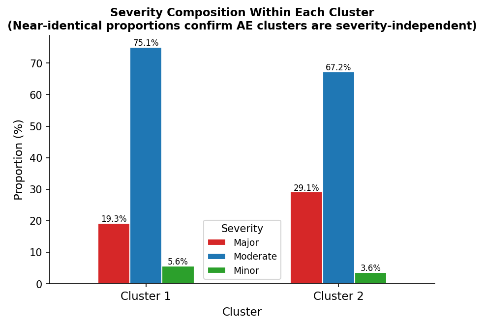

#### Figure C14. Per-Label F1 Score - Binary Side Effect Prediction
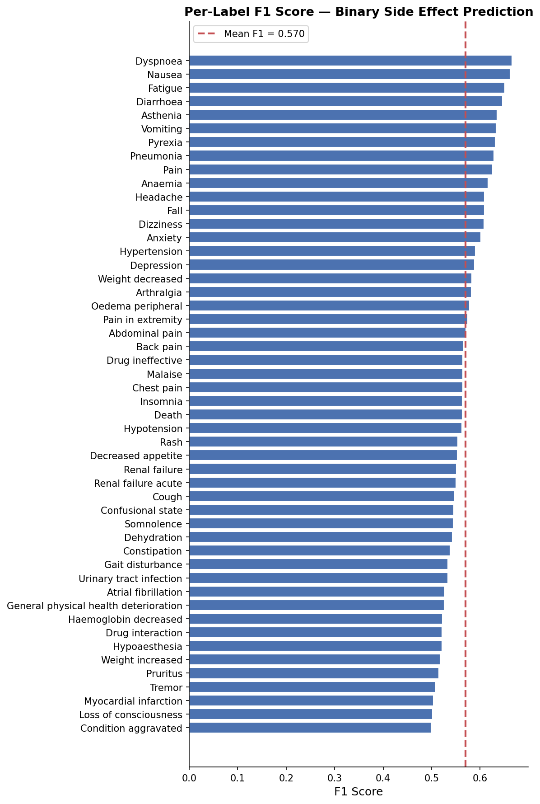

#### Figure C15. Per-Label Inverse RMSE - PRR Regression
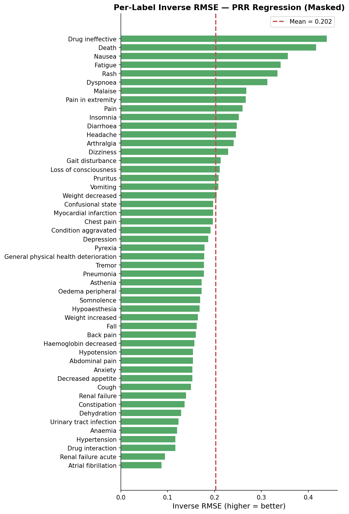

---

### Citations

1. Zhao D, Huang P, Yu L, He Y. Pharmacokinetics-Pharmacodynamics Modeling for Evaluating Drug-Drug Interactions in Polypharmacy: Development and Challenges. Clin Pharmacokinet. 2024;63(7):919-944.

2. Club Scientifique ESI, Hammani A. Deep-Pharma Multimodal Intelligence - DataHack 3.0 [Internet]. Kaggle; 2026 [cited 2026 Apr 15]. Available from: https://kaggle.com/competitions/deep-pharma-multimodal-intelligence-challenge-data-hack-3-0